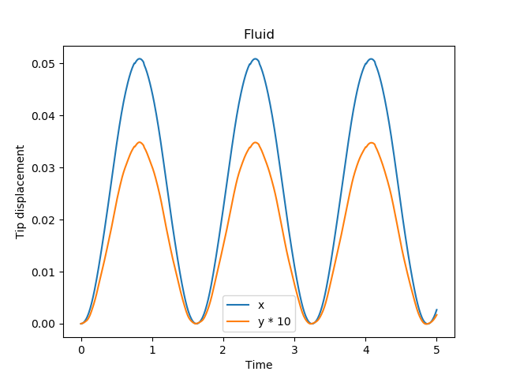

# fake-fluid

Main purpose of this case is to help us debugging. 

# Setup

The case provides the following load at the left face of the flat:

```
F(y) = (y*F_max/H, 0)
```

The force is linearly increasing from 0 to `F_max` and constant over time.

One can easily run this case together with other cases.

At the end of the simulation the script plots the displacement in x and y direction of the top-left corner of the flap.

# Use FEniCS as Solid:

Run

```
~/tutorials/perpendicular-flap/fluid-fake$ python3 fake-fluid.py 
```

and

```
~/tutorials/perpendicular-flap/solid-fenics$ python3 perp-flap.py 
```



Obtained results using FEniCS-adapter bf1df45624dfea4c5d0d72a9fa4a1755578b7420, branch develop.

# Use CalculiX as Solid:

Run

```
~/tutorials/perpendicular-flap/fluid-fake$ python3 fake-fluid.py
```

and

```
~/tutorials/perpendicular-flap/solid-calculix$ ./run.sh
```


Obtained results using CalculiX-adapter 63af15333c8d5f3ba85fdec28ec35042cb2691e2, branch handle2DInterfaces.

# Some Observations

* Frequency for CalculiX is slightly higher
* Amplitude for FEniCS is slightly higher
